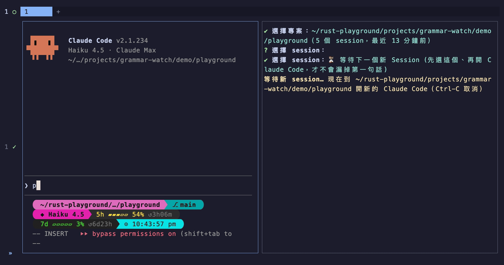

# grammar-watch

監看 coding agent（Claude Code、OpenAI Codex）的 session 紀錄，偵測到新打的 prompt 就送給 LLM，然後在終端機印出「你打了什麼 / 建議怎麼打 / 文法或單字的改進點」。

推薦在另一個 tmux window 或 Herdr pane 執行，工作時瞄一眼即可。



## 安裝

不需要 Rust 工具鏈，依平台擇一即可：

```bash
# macOS / Linux：Homebrew
brew install xavierforge/tap/grammar-watch

# macOS / Linux：安裝腳本（自動偵測平台，含 Apple Silicon 和 Linux aarch64）
curl -LsSf https://github.com/xavierforge/grammar-watch/releases/latest/download/grammar-watch-installer.sh | sh
```

```powershell
# Windows：PowerShell
powershell -ExecutionPolicy Bypass -c "irm https://github.com/xavierforge/grammar-watch/releases/latest/download/grammar-watch-installer.ps1 | iex"
```

有 Rust 的人也可以從原始碼裝：

```bash
cargo install --git https://github.com/xavierforge/grammar-watch
```

## 使用說明

```bash
export ANTHROPIC_API_KEY=sk-...

# 不帶參數：互動式選單（推薦）
grammar-watch

# 或直接指定 session 檔，兩家的 JSONL 格式會自動辨識，不用擔心
grammar-watch ~/.claude/projects/<專案編碼>/<uuid>.jsonl
grammar-watch ~/.codex/sessions/YYYY/MM/DD/rollout-xxx.jsonl
```

### 互動式選單

不帶參數啟動時，會列出偵測到的專案（實際路徑、session 數、最近活動時間，最新的排最前面）。

若同時有在用 Claude Code 和 Codex 的話，選單最上面會有分頁列、使用 **Tab** 能進行切換（預設停在最近有活動的那家），若只用一家的人則不會看到分頁列。

選了專案之後就能選 session（顯示時間、識別碼、第一句 prompt 的預覽）。

操作方法：↑↓ 移動、Tab 換工具、Enter 或 → 確認、← 或 Esc 回上一層（← 在專案層沒作用，Esc 在專案層是離開）、打字過濾、Ctrl-C 離開。

另外，session 清單的第一個選項是「**等待下一個新 Session**」，它存在的理由是因為 session 檔得等使用者打出第一句話才會建立，如果等到建立之後再附著既有檔案，就會漏掉第一句話。

這時候選這個選項、再去開新的 Claude Code 或 Codex，新檔一出現就能自動接上並從頭讀，讓第一句不會被漏掉。

### 供應商與模型

預設 Anthropic（haiku）。用 `--provider` 換供應商、`--model` 換模型，金鑰一律讀環境變數：

| provider     | 環境變數             | 預設模型                     |
|--------------|----------------------|------------------------------|
| `anthropic`  | `ANTHROPIC_API_KEY`  | `claude-haiku-4-5`           |
| `openrouter` | `OPENROUTER_API_KEY` | `anthropic/claude-haiku-4.5` |
| `gemini`     | `GEMINI_API_KEY`     | `gemini-2.5-flash`           |
| `openai`     | `OPENAI_API_KEY`     | `gpt-4.1-mini`               |

```bash
export OPENROUTER_API_KEY=sk-or-...
grammar-watch --provider openrouter --model google/gemini-2.5-flash
```

### 設定檔（選用）

`~/.config/grammar-watch/config.toml`（如果有設定 `XDG_CONFIG_HOME` 則以它為準）。
全部欄位都可省略，優先級是 CLI 旗標 > 設定檔 > 內建預設：

```toml
provider = "openrouter"                 # anthropic / openrouter / gemini / openai
model = "anthropic/claude-haiku-4.5"    # 省略就用該供應商的預設
log = "~/gw-journal.md"                 # 等同 --log：講評日誌
# extra = """講評改用英文"""            # 等同 --extra：補充講評偏好（語言、語氣）
```

### 講評語言與風格（選用）

講評預設用繁體中文。想換語言或調整語氣，用 `--extra` 旗標或設定檔的 `extra` 欄位補充偏好：

```bash
# 臨時：加旗標
grammar-watch --extra "講評改用英文"

# 常駐：寫進設定檔
echo 'extra = "講評改用日文，語氣輕鬆一點"' >> ~/.config/grammar-watch/config.toml
```

0.4 以前的 `preamble` 欄位（完全自訂 system prompt）已移除，設定檔如果還有會直接報錯。現行的 `extra` 只能調整語言和風格。

### 講評日誌

把每則講評附時間戳追加到一個本地檔案，可以拿來回顧自己常犯的錯。
開啟方式如下：

```bash
# 臨時：加旗標
grammar-watch --log ~/gw-journal.md

# 常駐：寫進設定檔，之後每次自動記
mkdir -p ~/.config/grammar-watch
echo 'log = "~/gw-journal.md"' >> ~/.config/grammar-watch/config.toml
```

有成功生效的話，啟動時「模型：」下面會多一行「日誌：~/gw-journal.md」。

檔案是純文字（markdown 風格），每則講評一段：

```
## 2026-08-21 14:03:21

原文：<實際打的字，多行照原樣保留>
建議：<建議句>
講評：<講評，含另一種說法>
```

等日誌累積一段時間後，直接餵給任何 LLM 就可以整理出屬於自己的「常犯錯誤週報」，例如：

```bash
cat ~/gw-journal.md | claude -p "歸納這份英文講評日誌最常見的錯誤模式：每類給出現次數、兩三個原文與建議的對照例句、一句針對性的改進建議"
```

再搭配 cron 每週一早上跑一次，就能有全自動的學習回顧。

### 其他行為

- 預設只看「啟動之後」的新 prompt。若要從頭檢討整個 session 的過往對話，請加 `--from-start` （`--from_start` 也可）；「等待下一個新 Session」模式一律從頭讀。
- **自動跟隨**：按 `/clear`（或 Codex 的 `/new`）開出新 session 時會自動切換過去從頭講評，不用重開；Codex 跨午夜換日期資料夾也會跟上。
- **閒置提醒**：整個監看範圍超過 15 分鐘沒動靜會提示一聲（工具可能已關閉），之後間隔翻倍再提醒。session 被 resume 的話會自動接續講評。
- 純中文或純指令（沒有英文字母）的行會自動跳過。

## session 紀錄在哪

- Claude Code：`~/.claude/projects/<專案路徑編碼>/<session-uuid>.jsonl`
- Codex：`~/.codex/sessions/YYYY/MM/DD/rollout-*.jsonl`

互動式選單會幫你翻這些資料夾，不用手動撈檔名。

## License

依 Rust 生態慣例採 MIT / Apache-2.0 雙授權，可任擇其一使用：

- [MIT License](LICENSE-MIT)
- [Apache License, Version 2.0](LICENSE-APACHE)

除非你另有明確聲明，你提交到本專案的任何貢獻（依 Apache-2.0 授權中的定義）都視為同意以上述雙授權釋出，不附加其他條款。
